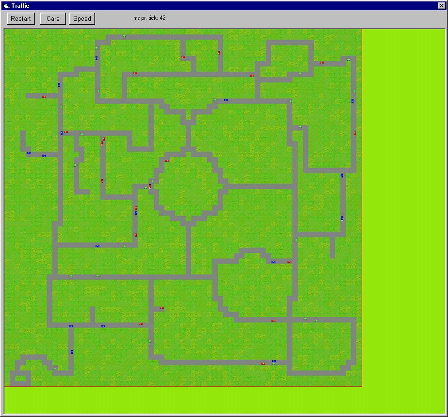

<div align="center">

## Traffic Simulator


</div>

### Description

Nothing, really, it simulates a basic traffic system. AI tell the cars to keep on route and make them turn at random when they reach a junction. This prog shows how to easy juse arrays in combination with bilblt to make STRATEGY GAME-ENGINES.
 
### More Info
 


<span>             |<span>
---                |---
**Submitted On**   |2001-07-21 18:09:46
**By**             |[Jonas Ask](https://github.com/Planet-Source-Code/PSCIndex/blob/master/ByAuthor/jonas-ask.md)
**Level**          |Intermediate
**User Rating**    |4.9 (39 globes from 8 users)
**Compatibility**  |VB 6\.0
**Category**       |[Games](https://github.com/Planet-Source-Code/PSCIndex/blob/master/ByCategory/games__1-38.md)
**World**          |[Visual Basic](https://github.com/Planet-Source-Code/PSCIndex/blob/master/ByWorld/visual-basic.md)
**Archive File**   |[Traffic Si232107212001\.zip](https://github.com/Planet-Source-Code/jonas-ask-traffic-simulator__1-25294/archive/master.zip)

### API Declarations

```
Public Declare Function BitBlt Lib "gdi32" (ByVal hDestDC As Long, ByVal X As Long, ByVal Y As Long, ByVal nWidth As Long, ByVal nHeight As Long, ByVal hSrcDC As Long, ByVal xSrc As Long, ByVal ySrc As Long, ByVal dwRop As Long) As Long
Public Declare Function GetTickCount Lib "kernel32.dll" () As Long
```


